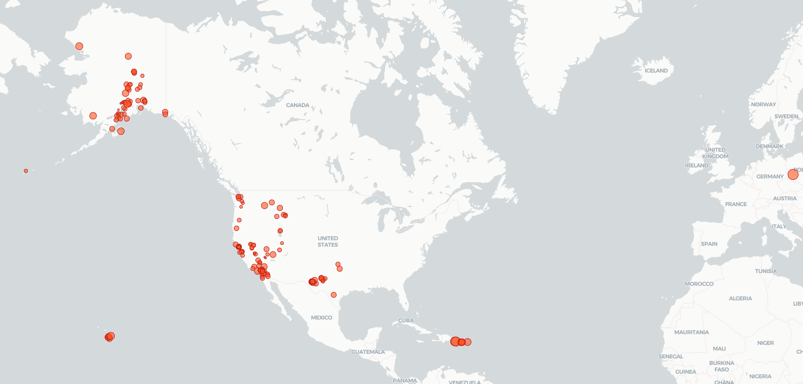

# Serverless Earthquake Data Visualization

A full-stack serverless application demonstrating **AWS infrastructure, CI/CD, and DevOps best practices**.

## Overview
- Fetches **live earthquake data** from an API via **Lambda + API Gateway**  
- Visualizes geospatial data using **React + MapLibre GL**, hosted on **S3**

## Key Highlights
- **Infrastructure as Code:** Terraform with remote state (S3 + DynamoDB)  
- **Serverless Deployment:** SAM-managed Lambda functions  
- **CI/CD Automation:** GitHub Actions pipelines for Terraform, Lambda, and frontend deployments  
- **Security & DevOps:** IAM roles with least privilege, environment-specific deployments, secret management  
- **Frontend Delivery:** React app hosted on S3, optionally served via CloudFront

## Tech Stack
AWS Lambda, API Gateway, DynamoDB, S3, Terraform, SAM, React, MapLibre GL, GitHub Actions

## Live Demo
View the live application here: [http://mapapp-frontend.s3-website-us-east-1.amazonaws.com/](http://mapapp-frontend.s3-website-us-east-1.amazonaws.com/)

  

## Why This Project
Demonstrates ability to **design, deploy, and operate cloud-native applications** with modern DevOps practices and fully automated CI/CD pipelines, visualizing **real-time earthquake data**.
